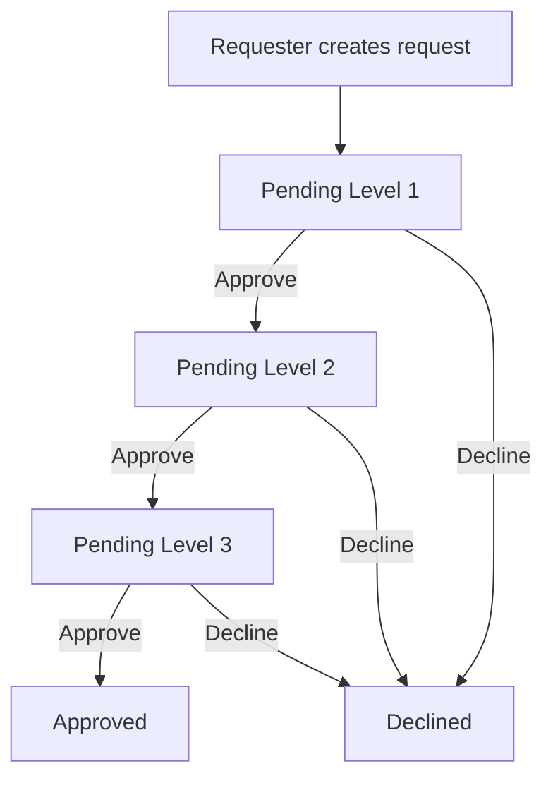

# Radio Station Request System - MOI Kuwait

A complete workflow management system for handling radio archive folder requests with multi-level approval process.

## 🎯 Overview

This system enables radio stations to request archive folders through a structured approval workflow involving three approval levels:
1. **Level 1:** عيسى العنزي (General Manager)
2. **Level 2:** مشعل سعود الزمنان (Supervisor)
3. **Level 3:** Eng. صادق (Archive Department Head)

## 🏗️ Architecture

### Frontend
- **Technology:** React 19
- **Hosting:** Netlify (recommended)
- **Features:**
  - Responsive Arabic UI
  - Real-time notifications
  - Role-based dashboards
  - Request timeline visualization

### Backend
- **Technology:** Node.js + Express
- **Database:** PostgreSQL
- **Hosting:** Render (recommended)
- **Features:**
  - JWT authentication
  - RESTful API
  - State machine workflow
  - Transaction-based operations

## 📁 Project Structure

```
raido station request folder/
├── frontend/               # React application
│   ├── src/
│   │   ├── components/    # React components
│   │   ├── config.js      # Environment configuration
│   │   ├── index.css      # Global styles
│   │   └── ...
│   ├── public/            # Static assets
│   ├── .env.example       # Environment template
│   ├── netlify.toml       # Netlify configuration
│   └── package.json
│
├── backend/               # Express API server
│   ├── server.js          # PostgreSQL version (production)
│   ├── server-sqlite.js   # SQLite version (local dev)
│   ├── setup-db-postgres.js    # PostgreSQL setup
│   ├── setup-db-sqlite.js      # SQLite setup
│   ├── .env.example       # Environment template
│   └── package.json
│
├── NETLIFY_DEPLOYMENT_GUIDE.md  # Step-by-step deployment
├── QUICK_REFERENCE.md           # Quick reference card
├── PROJECT_SUMMARY.md           # Project overview
├── CODE_SNIPPETS.md             # Useful code examples
└── README.md                     # This file
```

## 🚀 Quick Start

### Local Development

1. **Clone the repository**
   ```bash
   git clone https://github.com/yourusername/moi-radio-station-requests.git
   cd raido\ station\ request\ folder
   ```

2. **Set up Backend**
   ```bash
   cd backend
   npm install
   npm run setup-db-local    # Creates SQLite database
   npm run dev               # Starts backend on port 5000
   ```

3. **Set up Frontend** (in a new terminal)
   ```bash
   cd frontend
   npm install
   npm start                 # Starts frontend on port 3000
   ```

4. **Access the application**
   - Open http://localhost:3000
   - Login with test account: `10001` / `password123`

### Production Deployment

**See [`NETLIFY_DEPLOYMENT_GUIDE.md`](./NETLIFY_DEPLOYMENT_GUIDE.md) for complete step-by-step instructions.**

**Quick summary:**
1. Deploy backend to Render (with PostgreSQL)
2. Deploy frontend to Netlify
3. Configure environment variables
4. Update CORS settings
5. Test workflow

**Estimated time:** 1.5-2 hours
**Cost:** $0 (free tiers)

## 🔐 Test Accounts

| Role | Employee # | Password | Name |
|------|-----------|----------|------|
| **Requester** | 10001 | password123 | Quran Station |
| **Level 1 Approver** | 20001 | password123 | عيسى العنزي |
| **Level 2 Approver** | 30001 | password123 | مشعل سعود الزمنان |
| **Level 3 Approver** | 40001 | password123 | Eng. صادق |

## ✨ Features

### For Requesters
- ✅ Submit folder requests with program details
- ✅ Track request status in real-time
- ✅ View approval history and comments
- ✅ Receive notifications on status changes

### For Approvers
- ✅ View pending requests requiring action
- ✅ Approve or decline with comments
- ✅ View complete request timeline
- ✅ Dashboard with statistics

### System Features
- ✅ Three-level approval workflow
- ✅ State machine ensures data integrity
- ✅ Real-time notifications
- ✅ Role-based access control
- ✅ Arabic language support
- ✅ Mobile responsive design
- ✅ Secure JWT authentication

## 🔄 Approval Workflow



## 🌐 API Endpoints

### Authentication
```
POST /api/login
Body: { employee_number, password }
Response: { token, user }
```

### Requests
```
GET    /api/requests           # Get all (filtered by role)
GET    /api/requests/:id       # Get single with history
POST   /api/requests           # Create new
POST   /api/requests/:id/respond  # Approve/decline
```

### Dashboard
```
GET    /api/dashboard/stats    # Get user statistics
```

## 🛠️ Technology Stack

### Frontend
- React 19.2
- Native CSS (no framework - optimized for Arabic RTL)
- Fetch API for HTTP requests

### Backend
- Node.js
- Express 5.2
- PostgreSQL (production) / SQLite (development)
- JWT for authentication
- bcrypt for password hashing

### Deployment
- **Frontend:** Netlify (CDN, auto-deploy, free SSL)
- **Backend:** Render (auto-deploy, free tier, PostgreSQL included)

## 📚 Documentation

- **[NETLIFY_DEPLOYMENT_GUIDE.md](./NETLIFY_DEPLOYMENT_GUIDE.md)** - Complete deployment walkthrough
- **[QUICK_REFERENCE.md](./QUICK_REFERENCE.md)** - Commands, URLs, troubleshooting
- **[PROJECT_SUMMARY.md](./PROJECT_SUMMARY.md)** - System overview and architecture
- **[CODE_SNIPPETS.md](./CODE_SNIPPETS.md)** - Useful code examples
- **[DEPLOYMENT_GUIDE.md](./DEPLOYMENT_GUIDE.md)** - Alternative deployment options

## 🔒 Security

- JWT tokens with 24-hour expiration
- Password hashing with bcrypt
- CORS protection (configurable domains)
- SQL injection prevention (parameterized queries)
- HTTPS enforced (automatic on Netlify/Render)

## 🌍 Browser Support

- Chrome 90+
- Firefox 88+
- Safari 14+
- Edge 90+
- Mobile browsers (iOS 14+, Android 10+)

## 📱 Mobile Support

Fully responsive design tested on:
- iPhone (Safari)
- Android (Chrome)
- Tablets (iPad, Android tablets)

## 🐛 Troubleshooting

### Common Issues

**"Network Error" when logging in**
- Check backend is running
- Verify CORS is configured
- Check REACT_APP_API_URL is set correctly

**Backend gives DATABASE_URL error**
- Ensure environment variable is set in Render
- Copy Internal Database URL (not External)

**Changes not deploying**
- Frontend: Clear cache, trigger new deploy
- Backend: Git push triggers auto-deploy

**Backend sleeps after 15 minutes (Render free tier)**
- Normal behavior
- First request takes 30-60 seconds to wake
- Consider paid tier for production

See [QUICK_REFERENCE.md](./QUICK_REFERENCE.md) for more troubleshooting.

## 📈 Performance

- Frontend build size: ~500KB (gzipped)
- Backend response time: <100ms (excluding DB)
- Database queries: Optimized with indexes
- Netlify CDN: Global distribution
- Render: Auto-scaling enabled

## 🎨 Customization

### Change Colors
Edit `frontend/src/index.css`:
```css
:root {
  --primary: #2c3e50;    /* Main color */
  --success: #27ae60;    /* Approved */
  --danger: #e74c3c;     /* Declined */
  --warning: #f39c12;    /* Pending */
}
```

### Add New Role
1. Update database schema
2. Add role to `setup-db-postgres.js`
3. Update workflow state machine in `server.js`
4. Add role handling in frontend components

### Change Approval Levels
Modify state machine in `backend/server.js` → `/api/requests/:id/respond`

## 🔮 Future Enhancements

Potential features (not currently implemented):
- Email notifications
- File upload attachments
- Advanced search and filters
- Export to PDF/Excel
- Audit logs
- Analytics dashboard
- Custom approval workflows
- Multiple language support

## 📄 License

Internal use for Ministry of Information, Kuwait.

## 👥 Authors

Developed for MOI Radio Broadcasting Department.

## 📞 Support

For deployment issues, see:
- [NETLIFY_DEPLOYMENT_GUIDE.md](./NETLIFY_DEPLOYMENT_GUIDE.md)
- [QUICK_REFERENCE.md](./QUICK_REFERENCE.md)

For code issues:
- Check browser console (F12)
- Check Render logs (backend)
- Check Netlify build logs (frontend)

---

## 🎯 Getting Started Now

**New to the project?**
1. Read this README
2. Follow [NETLIFY_DEPLOYMENT_GUIDE.md](./NETLIFY_DEPLOYMENT_GUIDE.md)
3. Keep [QUICK_REFERENCE.md](./QUICK_REFERENCE.md) handy

**Ready to deploy?**
1. Have accounts on Render and Netlify
2. Follow deployment guide step-by-step
3. Test with provided test accounts
4. Share with team!

---

**Made with ❤️ for MOI Kuwait** 🇰🇼
